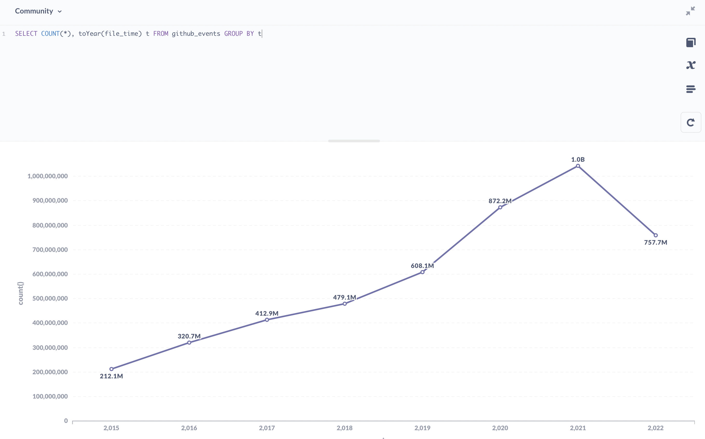

ClickHouse 社群基于自己的软件制作社群指标的探索，它提供了[公开数据集](https://clickhouse.com/docs/en/getting-started/playground)以供访问。

然而，由于遇到了公开数据集表模式缺列，查询执行内存限制，以及数据库只读模式限制等问题，我在过去一周里试着按照 [ClickHouse 官方博客](https://ghe.clickhouse.tech/#how-this-dataset-is-created)的介绍，搭建起了一个属于自有的基于 ClickHouse 的 GitHub 事件数据库。

简单介绍下结果，自建数据集确实解决了上面列举的三个问题。然而，我选择的 16 核 64 GB 内存版本实例在查询性能上还不如 Playground 的性能，只是内存占用大的聚合查询 Playground 可能由于 Quota 限制无法执行。另外，我选择的阿里云上的 ClickHouse 数据库在追上游版本和一些使用体验上还是有所欠缺。最后，日常数据同步的脚本可以在 [korandoru/github-adventurer](https://github.com/korandoru/github-adventurer) 取用。

当然，我会去做这件事，还有一个不可忽视的原因是我所在的公司本身商业模式就是云上售卖数据处理服务，我希望能够基于云上的服务搭建自己的业务，体验这个流程可能遇到的各种问题。因此，本文不是一个指导手册或者技术指南，而是实现过程中每个环节的杂谈。

<!--truncate-->

## Metabase 连接 ClickHouse 数据库

从做这个数据集的出发点开始谈起，ClickHouse 官方文档里有详细的介绍[如何连接 Metabase 的文档](https://clickhouse.com/docs/en/connect-a-ui/metabase-and-clickhouse/)。然而，实操过程中碰到了两大问题。

1. 前面提到的权限问题。Metabase 的 ClickHouse Driver 会向服务器发送设置查询参数的请求，由于 Playground 的服务器是 [READONLY=1](https://clickhouse.com/docs/en/operations/settings/permissions-for-queries/#settings_readonly) 的配置，因此 Metabase 无法连接。

这个问题是我陆陆续续花了一周时间准备自建数据集的出发点。技术上要么是 Driver 本身避免对这类语句的使用，因为在查询里带上查询相关的 SETTINGS 还是可以的；要么是 Playground 自己开启 READONLY=2 来允许这类查询。我也在上游提出了请求，这个确实只能由数据库管理员评估操作。

[Is it possible to set read_only=2 for playground dataset?](https://github.com/ClickHouse/github-explorer/issues/12)

2. Metabase 的插件问题。上一点提到，Metabase 想要连接 ClickHouse 是需要专门的 Driver 的。[metabase-clickhouse-driver](https://github.com/enqueue/metabase-clickhouse-driver) 是由社群成员提供的，而 Metabase 云服务只支持官方的插件，这就导致哪怕我想花钱采购 Metabase 云服务，也因为无法连接数据库只能作罢。

这其实侧面揭示了云服务的一个缺点，也就是用户的选择权实际上被云厂商所剥夺，云厂商提供什么能力，用户就只能用什么能力。回到中台战略的年代，那些得不到中台关照的小型业务往往只能自己挣扎求存。

面对这种形势，一方面是凸显出云中立的技术厂商的价值，以及原厂能够最大限度地提供新版支持和旧版兼容的优势，另一方面也让我想起了之前看过的一篇文章 [Local-first software](https://www.inkandswitch.com/local-first/) 里面提出的“你拥有自己的数据，而不是云厂商”的理念。

诚然，云服务能够在很多场景下避免投入开发的成本，也能提供相对优质的服务。但是如果你真的很看重拥有自己的数据，或者对于核心数据，不妨考虑一下数据所有权的问题。当然，反过来说，到底自己能不能做得比云厂商更可靠，也是需要慎重斟酌的，在特定的核心领域里做出投入重点保障，可能也是必要的成本。

话说回来，最终我是用了本地的 Metabase 实例 + 配置 Driver 跑起来了整体应用。借助 Metabase 的 BI 能力，探索出了诸如分时最活跃的参与者这样的一些指标。不过我的可视化功底非常差，做出来的图表不好意思见人。如果实在想看，可以打开[这条推文](https://twitter.com/tison1096/status/1557572123387777024)。

## 购买云上 ClickHouse 数据库实例

没有找到御三家的 ClickHouse 服务，国内云厂商倒是不少。由于其他云厂商不允许外网访问，看起来技术支持也非常值得怀疑，于是选择了[阿里云 ClickHouse 社区兼容版](https://www.aliyun.com/product/clickhouse)。

总的来说，还算能用，也确实解决了开篇提出的三个问题，在 ClickHouse.com 出云服务并且试用稳定之前，可能还是会勉强续费。实际使用过程里有这么些问题和体验。

1. 工单客服还是不错的。

大周末的值班，跟我这种要命的夜行性生物一起排查问题…我绝对不鼓励加班，过程里也表达了对同行的理解。只能说做服务业的，大家都不容易。整体解决问题的速度和能力值得赞同。

2. 外网访问需要技巧绕过。

由于众所周知的原因，本地机器 IP 不固定，服务部署的环境 IP 也不固定。我也不需要对这份数据集做特别极致的安全保护，于是尝试允许任意 IP 鉴权访问。不过，阿里云的产品显然有不一样的想法。它禁止了 0.0.0.0 的配置，又把 127.0.0.1 映射成仅允许本地访问。

不过广大人民群众的智慧是可靠的，[这条推文](https://twitter.com/ImperiusDs/status/1555156601698668544)里 @ImperiusDs 大佬想出了 127.0.0.1/1 的绕过方案，真是个天才。我希望阿里云不要不识好歹把这个方案也禁了，那我只能提前放弃续费了。

3. 内核版本不足。

众所周知，ClickHouse 冲版本非常快，以至于 Yandex 当初自己都跟不上上游版本。或许业务对版本的要求只是稳定就行，但我的场景是个人业务，版本不足会带来一些实际的问题。

第一个，client 每次链接的时候都会有 warning 提示。这点除了比较烦人还算好的了。

第二个，无法使用时间窗口等新功能。有些分析还是能用上会比较好，不是不能接受，稍微麻烦点。

第三个，不能支持跨域访问，这个就要命了。上游在去年底的时候才以 [Add CORS support](https://github.com/ClickHouse/ClickHouse/pull/29155) 解决了这个问题。没有跨域访问支持，我在制作[开源小镇](https://github.com/korandoru/open-source-town)网站的时候就没办法用自己的数据集了。可以说为了解决 Metabase 连接，我要用自己的数据集，网站上固化 Dashboard 展示，又得换回 Playground 的数据源，一来一去让我感觉花的钱真的是血亏。

为此，一方面我给阿里云提了工单，另一方面给 ClickHouse 上游也提了我三个具体 blocker 的问题清单，希望两者之间有一个能够解决问题，我就切到能解决问题的那一方去。自己维护一个 ClickHouse 服务器还是太要命了，不予考虑。

最后介绍一下价格。不得不说云上的存储确实便宜，扩容了 300GB 的存储每个月只多花几十块钱。目前的配置是单机 16 核 64GB 内存 + 500GB 云盘，每个月两千多块钱。这还是一笔不小的开销，目前的计划是利用 Metabase 尽量探索出有价值的指标，在网站上直接查 Playground 的数据出图表，一段时间后废弃数据集算逑。

## GitHub 事件全量数据概览

ClickHouse 官方博客写成的时候，数据是从 2011 年到 2020 年，压缩前数据集大概 1.2TB 大小，压缩后导出文件不到 100GB 大小。压缩比还是很夸张的。

我制作的数据集从 2015 年到 2022 年实时更新，总事件数 47 亿条，运行时占用磁盘空间 400GB 左右，原数据量没有记录，应该也是几个 TB 大小。

很明显，GitHub 的增长是飞快的，每年事件数也呈明显上升趋势。实际下载数据时候也能感受到逐年向前的数据下载压力。



由于 GitHub Events 只有公开仓库的数据，所以 public 之前私下开发的活动是不被记录的。此外，大家都知道 GitHub 的可靠性非常感人，实际上有一些时间段的数据是缺失的。

* 2016-01-28 01:00:00 ~ 02:00:00 数据缺失
* 2016-10-21 18:00:00 ~ 19:00:00 数据缺失
* 2018-10-21 23:00:00 ~ 2018-10-22 02:00:00 数据缺失
* 2019-05-08 12:00:00 ~ 14:00:00 数据缺失
* 2019-09-12 08:00:00 ~ 2019-09-13 06:00:00 数据缺失
* 2020-03-05 22:00:00 ~ 23:00:00 数据缺失
* 2020-06-10 12:00:00 ~ 22:00:00 数据缺失
* 2020-08-21 09:00:00 ~ 2020-08-23 16:00:00 数据缺失
* 2020-10-30 损坏一条数据 [id=14032425374](https://github.com/rust-num/num-bigint/pull/158#discussion_r515276395)
* 2021-08-25 17:00:00 ~ 2020-08-27 23:00:00 数据缺失
* 2021-09-11 损坏一条数据 [id=17943409164](https://github.com/baogaopro/images13/commit/f5cf22c7fa765a496adfdb3c99bb44a20cbaa182)
* 2021-10-22 05:00:00 ~ 23:00:00 数据缺失
* 2021-10-23 02:00:00 ~ 23:00:00 数据缺失
* 2021-10-24 03:00:00 ~ 23:00:00 数据缺失
* 2021-10-26 00:00:00 ~ 2021-10-29 18:00:00 数据缺失

除了这些整段的数据缺失以外，部分数据缺失也是可能的。CNCF 的 [devstats](https://github.com/cncf/devstats) 项目有一系列的补偿逻辑来修复数据，这里不做展开。

总的来说，GitHub 事件数据集没有单个事务级别的完整性，也就是因果性无法完全保证，只适合做一些粗略的倾向分析和大数统计，无法做特别精确的因果分析。

## GitHub 事件的数据模型

ClickHouse 官方博客 [How to choose the structure for the data?](https://ghe.clickhouse.tech/#how-to-choose-the-structure-for-the-data) 章节已经讲清楚了数据模型的选型。前文提到的 devstats 和 PingCAP 的 [OSSInsight](https://ossinsight.io/) 都是关系型数据库打底，基本是多个具体表分发处理不同事件类型，查询时走 JOIN 查询来出结果的。ClickHouse 作为列存数据库，则更加倾向于一张大表多个列储存所有数据，也是因为这种模式，才能做到数据极高的压缩比和查询时的过滤效率。

我所采取的建表模式和官方博客的模式略有不同，这也是我选择自建数据集的关键原因之一。

```sql
CREATE TABLE default.github_events
(
    `file_time` DateTime,
    `event_id` UInt64,
    `actor_id` UInt64,
    `repo_id` UInt64,
    `event_type` Enum8('CommitCommentEvent' = 1, 'CreateEvent' = 2, 'DeleteEvent' = 3, 'ForkEvent' = 4, 'GollumEvent' = 5, 'IssueCommentEvent' = 6, 'IssuesEvent' = 7, 'MemberEvent' = 8, 'PublicEvent' = 9, 'PullRequestEvent' = 10, 'PullRequestReviewCommentEvent' = 11, 'PushEvent' = 12, 'ReleaseEvent' = 13, 'SponsorshipEvent' = 14, 'WatchEvent' = 15, 'GistEvent' = 16, 'FollowEvent' = 17, 'DownloadEvent' = 18, 'PullRequestReviewEvent' = 19, 'ForkApplyEvent' = 20, 'Event' = 21, 'TeamAddEvent' = 22),
    `actor_login` LowCardinality(String),
    `repo_name` LowCardinality(String),
    `created_at` DateTime,
    `updated_at` DateTime,
    `action` Enum8('none' = 0, 'created' = 1, 'added' = 2, 'edited' = 3, 'deleted' = 4, 'opened' = 5, 'closed' = 6, 'reopened' = 7, 'assigned' = 8, 'unassigned' = 9, 'labeled' = 10, 'unlabeled' = 11, 'review_requested' = 12, 'review_request_removed' = 13, 'synchronize' = 14, 'started' = 15, 'published' = 16, 'update' = 17, 'create' = 18, 'fork' = 19, 'merged' = 20),
    `comment_id` UInt64,
    `body` String,
    `path` String,
    `position` Int32,
    `line` Int32,
    `ref` LowCardinality(String),
    `ref_type` Enum8('none' = 0, 'branch' = 1, 'tag' = 2, 'repository' = 3, 'unknown' = 4),
    `creator_user_login` LowCardinality(String),
    `number` UInt32,
    `title` String,
    `labels` Array(LowCardinality(String)),
    `state` Enum8('none' = 0, 'open' = 1, 'closed' = 2),
    `locked` UInt8,
    `assignee` LowCardinality(String),
    `assignees` Array(LowCardinality(String)),
    `comments` UInt32,
    `author_association` Enum8('NONE' = 0, 'CONTRIBUTOR' = 1, 'OWNER' = 2, 'COLLABORATOR' = 3, 'MEMBER' = 4, 'MANNEQUIN' = 5),
    `closed_at` DateTime,
    `merged_at` DateTime,
    `merge_commit_sha` String,
    `requested_reviewers` Array(LowCardinality(String)),
    `requested_teams` Array(LowCardinality(String)),
    `head_ref` LowCardinality(String),
    `head_sha` String,
    `base_ref` LowCardinality(String),
    `base_sha` String,
    `merged` UInt8,
    `mergeable` UInt8,
    `rebaseable` UInt8,
    `mergeable_state` Enum8('unknown' = 0, 'dirty' = 1, 'clean' = 2, 'unstable' = 3, 'draft' = 4),
    `merged_by` LowCardinality(String),
    `review_comments` UInt32,
    `maintainer_can_modify` UInt8,
    `commits` UInt32,
    `additions` UInt32,
    `deletions` UInt32,
    `changed_files` UInt32,
    `diff_hunk` String,
    `original_position` UInt32,
    `commit_id` String,
    `original_commit_id` String,
    `push_size` UInt32,
    `push_distinct_size` UInt32,
    `member_login` LowCardinality(String),
    `release_tag_name` String,
    `release_name` String,
    `review_state` Enum8('none' = 0, 'approved' = 1, 'changes_requested' = 2, 'commented' = 3, 'dismissed' = 4, 'pending' = 5)
)
ENGINE = ReplacingMergeTree
ORDER BY (event_type, repo_name, created_at, event_id)
```

可以看到，表格列添加了 `event_id` / `actor_id` / `repo_id` 三列，这是因为需要 event_id 去重，后两者可以较好地应对用户和仓库改名的情况。

同时，表引擎选择的是 `ReplacingMergeTree` 引擎而非 `MergeTree` 引擎，并多制定了 `event_id` 作为排序键，同时也是 `ReplacingMergeTree` 的去重基准。

## 数据集的具体制作

可以在 korandoru/github-adventurer GitHub 仓库上获取制作数据集的所有相关脚本。

目前，我通过 GitHub Actions 每个小时增量从 GHArchive 拉取新数据插入到数据库里。对于全量的导入，只需要把 `download.sh` 的逻辑替换成全量下载即可。由于没有云服务器可以直接用，购买云服务器和带宽我血亏了几百块钱以后发现还不如本地机器来的靠谱，所以最后是用自己的机器分批次导入全量数据的。GHArchive 数据下载不用梯子就可以访问，速度也很快。

增量数据下载上游的脚本是全量存储了所有 `.json.gz` 的原始文件，所以可以直接以当前时间为基准框出前后十二个小时的数据集文件名后过滤。我没有那么大的存储空间，只能从当前最新的数据往后连续数一天了。

具体的脚本逻辑不逐行讨论，只说几个值得一提的点。

1. 导入 GitHub 事件数据的过程确实就是一个 ETL 的过程，为此我直接把分阶段的处理文件叫做 extract / transform / (up)load 了。

这当然不止是因为强迫症。全量导入数据的时候，下载完成以后从 `flatten.sh` 入口驱动批量导入，由于网路和数据质量等原因有些数据可能导入失败，这个时候就只需要从错误输出里找到失败的数据，传参给 `transform.sh` 重新导入即可。

这里也可以以小见大看出软件开发过程里模块化的好处来，能够分离关注点避免同时处理多个事情对人的生理挑战进而引入缺陷，每个阶段的逻辑可以单独复用而无需重复编写。

2. 处理 JSON 数据时用的是 `jq` 这个实用工具，强烈推荐。

不过 [jq](https://stedolan.github.io/jq/) 处理的速度也不算快。数据导入的时候我按照本地核数做数据并发，10 个并发的情况下最后数据库导入效率也就每秒 15MB 左右，升配了也上不去，属于本地处理的瓶颈了。

3. ClickHouse 对数据输入和输出的[格式](https://clickhouse.com/docs/en/interfaces/formats)支持做得非常到位。

`JSONCompactEachRow` 输入和 HTTP 的 `FORMAT JSON` 输出，跟后端程序还有网页对接起来不要太爽。导入数据再也不用跟复杂的 INSERT 语句打架了。

4. [dotenv](https://dotenv.org/) 对统一开发环境和生产环境部署有很大的帮助。

可以看到，自建数据集需要配置自己购买的数据库实例。很多应用都会包含敏感的配置信息，过去都是八仙过海处理不同环境下的配置。无论是不同的处理逻辑，还是命令行传参，都不是那么舒服。

如今，dotenv 越来越多得到用户的青睐，不是没有道理的。因为理念足够简单，要么从 `.env` 文件读取配置，要么从环境变量读取，所以绝大部分集成开发环境和语言都支持和 dotenv 标准协同工作。本地走一个 `.env` 文件并从 VCS 里 ignore 掉，生产环境配置环境变量，就能解决逻辑不一致和命令行传参仍然有泄露风险的问题。

当然，dotenv 对复杂数据类型的支持一般。对于复杂的配置需求，还是需要专门的配置系统来处理。但是连接到配置系统的地址和用户信息又可以用 dotenv 管起来。总之和 `jq` 一样，属于新一代生产力利器。

还有一些 bash shell 和 GitHub 的小技巧就不一一罗列了，从 korandoru/github-adventurer 的源码里都能看出端倪。

回顾一下这轮工作的成果，自建数据集确实解决了一开始列举的三个问题。但是阿里云版 ClickHouse 并不能解决我遇到的所有问题，我现在需要同时连接两个数据库完成 Metabase BI 探索和网页端查询固化的工作。如果 ClickHouse.com 上线了云服务，我会再尝试一下。另外，现在对云服务的使用也算一回生二回熟了，如果有精力我可以看看用 cockroachdb 平替 PostgreSQL 以每种 event 一张表的形式来组织数据。目前至少也有一些用户详情的元数据想存到一个关系型数据库上的需求。
