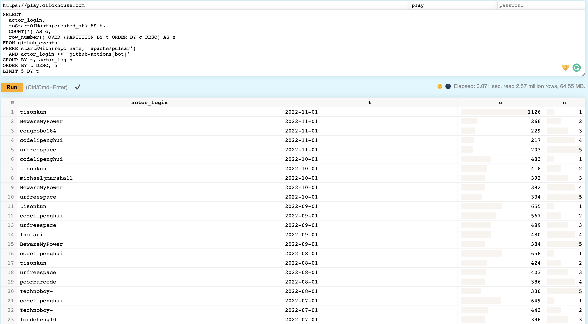
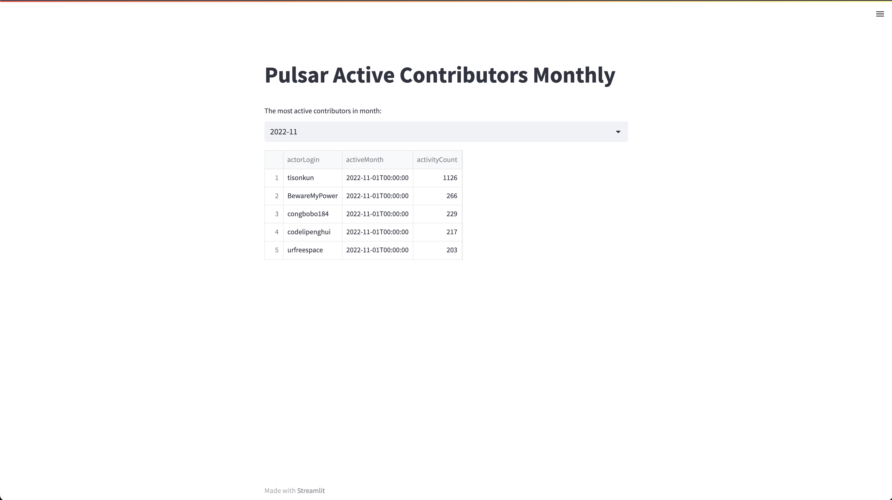

# Apache Pulsar 活跃参与者每月看板

本文介绍如何基于 ClickHouse 社群提供的 [GitHub 公开数据集](https://clickhouse.com/docs/en/getting-started/playground)制作每月活跃参与者看板。如果你想搭建一个自有的 GitHub 数据集，可以阅读博客[《基于 ClickHouse 的 GitHub 事件数据库》](/blog/github-adventurer-with-clickhouse)。

## 查询

可以在公开数据集的 [playground](https://play.clickhouse.com/play?user=play) 上运行以下 SQL 语句查询结果：

```sql
SELECT
  actor_login,
  toStartOfMonth(created_at) AS t,
  COUNT(*) AS c,
  row_number() OVER (PARTITION BY t ORDER BY c DESC) AS n
FROM github_events
WHERE startsWith(repo_name, 'apache/pulsar')
  AND actor_login <> 'github-actions[bot]'
GROUP BY t, actor_login
ORDER BY t DESC, n
LIMIT 5 BY t
```

结果如下：



其中，

* `github_events` 是公开数据集的名称
* `startsWith(repo_name, 'apache/pulsar')` 用于筛选统计活跃度的仓库群，也可以使用 `(repo_name IN (...))` 枚举
* `actor_login <> 'github-actions[bot]'` 用于筛选机器人账号或是已知的活跃用户，因为通过指标的主要目的是发现新人扩充知识

以及一个计算 TopN 的固定格式：

```sql
SELECT * FROM (
  SELECT
    name,
    score,
    class,
    row_number() OVER (PARTITION BY class ORDER BY score DESC) AS rank
  FROM students
) ranked
WHERE rank <= 10;
```

## 展示

除了直接在 ClickHouse Playground 的 WebUI 上查询展示，还可以通过 [Streamlit](https://streamlit.io/) 来提供丰富的数据展示方案。

第一步，安装必要依赖：

```bash
pip3 install streamlit clickhouse_connect
```

第二步，创建 `active-contributors-monthly.py` 文件并编写必要代码：

```python
import functools
import clickhouse_connect
import streamlit as st

st.title('Pulsar Active Contributors Monthly')

@functools.lru_cache
def obtain_client():
    return clickhouse_connect.get_client(host='play.clickhouse.com', port=443, username='play')

@st.cache
def active_contributors():
    df = obtain_client().query_df("""
        SELECT
            actor_login AS actorLogin,
            t AS activeMonth,
            c AS activityCount,
            n AS activityRank
        FROM
        (
            SELECT
                actor_login,
                toStartOfMonth(created_at) AS t,
                COUNT(*) AS c,
                row_number() OVER (PARTITION BY t ORDER BY c DESC) AS n
            FROM github_events
            WHERE startsWith(repo_name, 'apache/pulsar')
              AND actor_login <> 'github-actions[bot]'
            GROUP BY t, actor_login
            ORDER BY t, n
            LIMIT 5 BY t
        )
        """)
    return df

@st.cache
def valid_months():
    df = obtain_client().query_df(query="""
        SELECT toStartOfMonth(created_at) AS t
        FROM github_events
        WHERE startsWith(repo_name, 'apache/pulsar')
          AND actor_login <> 'github-actions[bot]'
        GROUP BY t
        ORDER BY t DESC
        """)
    return df['t']

candidates = valid_months()
prefetch_result = active_contributors()

selected_month = st.selectbox(
    'The most active contributors in month:',
    candidates,
    format_func=lambda d : d.to_pydatetime().strftime('%Y-%m'))
st.dataframe(prefetch_result[prefetch_result['activeMonth'] == selected_month].set_index('activityRank'))
```

第三步，启动 Streamlit 应用：

```bash
streamlit run active-contributors-monthly.py
```

如果一切正常，Streamlit 将打开一个访问 http://localhost:8501/ 的窗口，如下所示：



可以阅读 [Streamlit 官方文档](https://docs.streamlit.io/)和 [ClickHouse 相关文档](https://clickhouse.com/docs)进一步定制。
