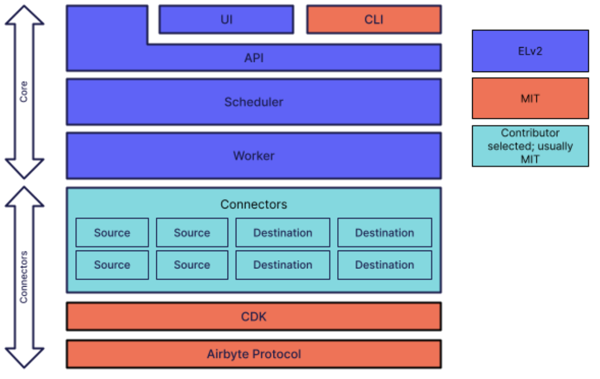

# 选择软件许可证

开源软件和自由软件的概念与其许可证紧密绑定。

通常，开源软件被定义为使用 OSI 认可的，即符合[开源定义](https://opensource.org/osd)的许可证来分发的软件，而自由软件被定义成使用 GPL 或说 Copyleft 式许可证分发的软件。

尽管今天人们最关心的可能是软件的生产过程即如何进行开源协同，但是为软件选择什么样的许可证，仍然是一个项目启动时必须考虑和决定的问题。某种意义上说，软件可以被如何使用和分发，反过来约束了可能实现的协同模式。

GitHub 维护了 [ChooseALicense.com](https://choosealicense.com/) 网站以准确、中立地提供常用开源许可证的介绍，并指引开发者为他们的项目选择合适的许可证。不过，这个页面并没有针对企业开源的情形做出针对性的讨论。

本文从企业开源的场景出发，讨论选择不同开源许可证或源码可得的软件许可证，对企业和项目的影响，并给出主观的建议。

<!-- more -->

## Permissive Software Licenses

如今，开源软件选择最多的许可证类别是[宽松软件许可证](https://en.wikipedia.org/wiki/Permissive_software_license)。

这类许可证基本上在保留著作权的基础上允许任何人将软件用于任何用途，包括自由地修改和分发，甚至修改版本可以按照任何条款发布，比如添加专有软件式的限制条款。

### MIT LICENSE

以使用范围最广的 [MIT LICENSE](https://opensource.org/licenses/MIT) 为例，其内容非常简练：

> Copyright (c) [year] [copyright holders]
>
> Permission is hereby granted, free of charge, to any person obtaining a copy of this software and associated documentation files (the "Software"), to deal in the Software without restriction, including without limitation the rights to use, copy, modify, merge, publish, distribute, sublicense, and/or sell copies of the Software, and to permit persons to whom the Software is furnished to do so, subject to the following conditions:
>
> The above copyright notice and this permission notice shall be included in all copies or substantial portions of the Software.
>
> THE SOFTWARE IS PROVIDED "AS IS", WITHOUT WARRANTY OF ANY KIND, EXPRESS OR IMPLIED, INCLUDING BUT NOT LIMITED TO THE WARRANTIES OF MERCHANTABILITY, FITNESS FOR A PARTICULAR PURPOSE AND NONINFRINGEMENT. IN NO EVENT SHALL THE AUTHORS OR COPYRIGHT HOLDERS BE LIABLE FOR ANY CLAIM, DAMAGES OR OTHER LIABILITY, WHETHER IN AN ACTION OF CONTRACT, TORT OR OTHERWISE, ARISING FROM, OUT OF OR IN CONNECTION WITH THE SOFTWARE OR THE USE OR OTHER DEALINGS IN THE SOFTWARE.

这段内容可以分成两部分来看。第一部分是只要保留原作者信息和 MIT LICENSE 的拷贝，就可以任意使用本软件。第二部分是全大写的免责声明，即软件按照原样（AS IS）提供，任何情况下原作者或著作权人不对使用软件导致的问题负责。

这基本符合企业开源的直觉：出于某种原因我想要以开源形式发布一个软件，或者后续围绕软件项目建立一个社群，我希望这个软件跟企业的品牌保持关联甚至绑定，同时不希望在没有额外合同的情况下，莫名其妙为使用我开源的软件带来的问题负责。

### Apache License 2.0

其他宽松软件许可证基本也延续了 MIT LICENSE 的理念，大同小异，使用起来也没有本质的差别。唯一有明显区别的是 [Apache License 2.0](https://www.apache.org/licenses/LICENSE-2.0) 协议。

顾名思义，Apache License 2.0 由 Apache 软件基金会出品。Apache 软件基金会的建立背景是 Apache Web Server 被越来越多商业公司使用，商业公司希望与开发 Apache Web Server 的群体进行正式合规的实体互动，包括捐赠、商标品牌使用和联合举办活动等等。

在这样的背景下，Apache License 2.0 吸引了相当的志愿者律师参与，于 2004 年推出。它与 MIT LICENSE 最大的不同在于法律用语的规范化，以及对专利和商标使用权利的明晰。

其中第三条，写明使用软件所需的所有专利都自动授权给任何人。这就保证了用户不用担心软件许可证只授权了代码的使用权利，而使用过程中涉及的专利没有明确授权带来的未知风险。同时，本条写明这种专利授权不支持用户以此提起诉讼，也就是你用了 Apache License 2.0 许可的软件创建派生作品，随后其他人使用，你不能以 Apache License 2.0 授权你使用相关专利为由，起诉其他人侵犯这些专利。

开源项目 Taichi Lang 从 MIT LICENSE 改为 Apache License 2.0 的讨论当中，就提到这一条款消除了用户的担忧。

* [A vote to change license to Apache-2.0](https://github.com/taichi-dev/taichi/issues/4607)

同样，自由软件基金会也因此推荐喜欢宽松许可证理念的开发者选择 Apache License 2.0 作为其软件许可证。

* [Various Licenses and Comments about Them](https://www.gnu.org/licenses/license-list.en.html#apache2)
* [How to Choose a License for Your Own Work](https://www.gnu.org/licenses/license-recommendations.html)

其中第六条，写明 Apache License 2.0 并不授予商标使用权利。也就是要在市场营销等活动当中使用被许可软件的商标，需要额外的协议。这实际上保护了软件作者或著作权人的声誉，避免下游混淆上游软件的品牌，或者诱导用户产生上游为其背书的印象。

其中第五条，写明 Contribution 都默认遵守本协议的所有条款，因此作者可以放心地整合补丁并重新分发。

其中第四条和第九条，明确了派生作品添加专有软件式的条款，或者下游提供额外的担保和附加责任，不会影响上游及其他开发者。

此外，Apache License 2.0 的页面上，还建议开发者为每一个构成作品的文件添加协议模板，保证每个文件的内容被单独使用时，也可以依据 Apache License 2.0 的内容来明确使用条件。关于这个动作的意义，可以参考推特上有关代码与 Apache License 2.0 许可的[讨论](https://twitter.com/wusheng1108/status/1602600761333932032)。

因此，总体来说，**对于朴素地希望发布一个开源软件，允许所有人任意使用，同时保证自己免受不必要地打扰的情况，选择 Apache License 2.0 就是最合适的**。

## Source Avaiable Licenses

2018 年，一系列“开源软件公司”以不菲的价值上市或被收购，一时激起了“开源商业化”的浪潮。然而，在接下来的几年里，这其中的部分企业陆续将软件许可证从开源许可证换到某种受限的源码公开许可证。

* [Upcoming licensing changes to Elasticsearch and Kibana](https://www.elastic.co/blog/licensing-change)
* [Why We're Relicensing CockroachDB](https://www.cockroachlabs.com/blog/oss-relicensing-cockroachdb/)
* [A New License to Future Proof the Commoditization of Data Integration](https://airbyte.com/blog/a-new-license-to-future-proof-the-commoditization-of-data-integration)
* [Why We Are Changing the License for Akka](https://www.lightbend.com/blog/why-we-are-changing-the-license-for-akka)

这当中最常见的两个软件许可证，就是 Elastic 发布的 [Elastic License 2.0](https://www.elastic.co/licensing/elastic-license) 协议，以及 MariaDB 发布的 [Business Source License 1.1](https://mariadb.com/bsl11/) 协议。

### Elastic License 2.0

Elastic License 2.0 协议被 Elastic 和 Airbyte 等公司使用，主要目的是禁止商业竞争。ELv2 的主要内容在其“限制”一节，内容如下：

> 1. You may not provide the software to third parties as a hosted or managed service, where the service provides users with access to any substantial set of the features or functionality of the software.
> 2. You may not move, change, disable, or circumvent the license key functionality in the software, and you may not remove or obscure any functionality in the software that is protected by the license key.
> 3. You may not alter, remove, or obscure any licensing, copyright, or other notices of the licensor in the software. Any use of the licensor’s trademarks is subject to applicable law.

可以看到，这主要保留软件作者的三项权利：

第一，禁止其他人对外提供同类服务。对于 ElasticStack 来说，就是同类的搜索服务或者 Kibana 的展示服务；对于 Airbyte 来说，就是数据同步服务。

这里有两个注意点。第一个是这项限制只在接收方向第三方提供服务时才会触发，也就是如果下游公司只在内部使用服务自己的业务，是不会触发这项限制的。第二个是对第三方提供服务的定义限制在同样的功能集上，也就是说 API 表现大相径庭的传递依赖不会触发这项限制。

举个例子，国内某知名电商公司大规模部署了 ELK Stack 作为倒排索引解决方案，但是直接调用 Elastic API 的服务都是内部服务，因此不会因为第一点触发限制。进一步地，其对外提供的是电商业务下的 CRUD 接口，而从不直接提供与 Elastic 同质化的 API 服务，因此不会因为第二点触发限制。

第二，禁止其他人破解密钥。这个条款是因为 Elastic 把一些高级功能的代码写在主仓库里，又希望限制用户必须付费购买密钥才能启用。由于这种密钥鉴权的逻辑基本就是个 if-else 块，如果没有这一条，前面又允许用户任意修改代码，用户可以很轻易地修改源代码直接使用上游厂商用密钥限制的功能。

早期的 Open Core 的开发模式实际上是通过把高级功能所需的接口写在开放的部分，实现独立发布来解决高级功能收费的问题。ELv2 这一条主要是工程上偷懒，把高级功能代码直接写进主仓库，以一个很容易破解的密钥保护，又在许可里禁止破解密钥完事。

Elastic 的代码相对比较复杂，国内的开放核心软件 Bytebase 使用了相似的模式以密钥限制部分高级功能的使用，代码相对简单易懂，可以阅读相关源码来了解这个模式的使用情况。

* [bytebase: enterprise/api/license.go](https://github.com/bytebase/bytebase/blob/40080cbab177307fde3c0f27a9bce5f72e0e74ba/enterprise/api/license.go)

第三，禁止未经允许使用商标，或者修改任何版权信息。这个和 Apache License 2.0 的要求其实是一致的。

总的来说，ELv2 对应的商业模式相对自信。它允许用户将软件用于内部服务，无论多大规模。只是当用户无力自己维护内部服务时，通过限制市场上只有自己一家可以提供托管服务，来获得提供服务的垄断地位。

### Business Source License 1.1

Business Source License 1.1 被 Cockroach Labs 和 Lightbend 等公司使用，其主要特点有两个：

* 其一是必须约定一个不长于四年的时间，以 BSL 1.1 发布的代码版本在过了这段时间以后，自动以符合开源定义的协议重新许可，通常是 Apache License 2.0 协议。
* 其二是上游企业可以约定任意的生产环境使用限制，由于这个约定是任意的，所以采用 BSL 1.1 对应的商业类型也不是单一的。

例如，[CockroachDB 的 LICENSE](https://github.com/cockroachdb/cockroach/blob/93ed65565357538c9048ff45c878a493f2ed9b45/licenses/BSL.txt) 写法如下：

> You may make use of the Licensed Work, provided that you may not use the Licensed Work for a Database Service.
>
> A “Database Service” is a commercial offering that allows third parties (other than your employees and contractors) to access the functionality of the Licensed Work by creating tables whose schemas are controlled by such third parties.

可以看到，这个写法和 ELv2 的第一项限制是一致的，除了对同类服务做了更详细的说明。因此，Cockroach Labs 的商业模型和上面对 ELv2 的总结也大致相同。

同样以这种方式使用 BSL 1.1 的还有 Outline 公司，其知识库软件 [Outline 的 LICENSE](https://github.com/outline/outline/blob/9618d514e155358153d3d3f07e8e1662c84bd59c/LICENSE) 表述如下：

> You may make use of the Licensed Work, provided that you may not use the Licensed Work for a Document Service.
>
> A “Document Service” is a commercial offering that allows third parties (other than your employees and contractors) to access the functionality of the Licensed Work by creating teams and documents controlled by such third parties.

反观 Lightbend 和 Materialize Inc. 等公司，对使用限制的表述则有很大的出入。

[Akka 的 LICENSE](https://github.com/akka/akka/blob/b7b79a2da1231520fe66532b7af53179d1714952/LICENSE) 表述如下：

> If you develop an application using a version of Play Framework that utilizes binary versions of akka-streams and its dependencies, you may use such binary versions of akka-streams and its dependencies in the development of your application only as they are incorporated into Play Framework and solely to implement the functionality provided by Play Framework; provided that, they are only used in the following way: Connecting to a Play Framework websocket and/or Play Framework request/response bodies for server and play-ws client.

同时，在 Akka 的 [License FAQ](https://www.lightbend.com/akka/license-faq) 页面上，有这样的一段话：

> The BSL is a source available license that freely allows usage of the code for development and other non-production work such as testing. Production use of the software requires a commercial license. The commercial license will be available for early stage companies (less than US $25m in annual revenue) at no charge.

基本上，Lightbend 允许初创公司向它索要一份免费使用的商业协议，而通过非常复杂的生产环境使用条件实质上限制了任何有意义的用途。

[Materialize 的 LICENSE](https://github.com/MaterializeInc/materialize/blob/937a0983c0bda4e2cf86b36c51f8123a3e236f9e/LICENSE) 表述如下：

> Within a single installation of Materialize, you may create one compute cluster with one single-process replica for any purpose, and you may concurrently use multiple such installations, subject to each of the following conditions: (a) you may not create installations with multiple clusters, nor compute clusters with multiple replicas, nor compute cluster replicas with multiple processes; and (b) you may not use the Licensed Work for a Database Service. A “Database Service” is a commercial offering that allows third parties (other than your employees and contractors) to access the functionality of the Licensed Work by creating views whose definitions are controlled by such third parties.

除了与 CockroachDB 同款的禁止同类服务以外，Materialize 还通过限制集群的用法实质上将免费的生产用例限制在玩具级别。

这和 MariaDB 公司最早用于其 [MaxScale](https://github.com/mariadb-corporation/MaxScale/blob/002b304e39cc9062242f75120e27f6ee69953507/LICENSE2208.TXT) 项目的用法是一致的：

> You may use the Licensed Work when your application uses the Licensed Work with a total of less than three server instances for any purpose.

总的来说，BSL 1.1 至少约定了代码一定时间后以开源协议重新许可的条款，而 ELv2 对此只字不提，永远是受限的。然而，这种“当下收费，未来免费”的模式，Eric S. Raymond 在文章《魔法锅》里直指它的缺点：在软件早期，封闭条款往往限制了同行评审和参与，而那时是最需要这些的时候。

从商业模式的角度来看，由于附加条款的灵活性，BSL 1.1 许可的软件可以实现与 ELv2 许可的软件相近的商业模型，也可以更加严苛地限制生产使用，使得任何大规模使用都必须付费。

[诱导转向的伪开源战略](/enterprise/bait-and-switch-fauxpen-source-strategy/)里提到，**如果企业初心就是“写个软件好卖钱”，那么选择这类限制性的源码可得软件许可证，是比较合适的**。

## Copyleft Licenses

另一类不容忽略的软件许可证是 Copyleft 式协议，主要代表为 [GPLv2](https://www.gnu.org/licenses/old-licenses/gpl-2.0.en.html)/[GPLv3](https://www.gnu.org/licenses/gpl-3.0.en.html)/[AGPLv3](https://www.gnu.org/licenses/agpl-3.0.en.html) 等。

从历史沿革来看，最早使用 Copyleft Licenses 许可软件产品的知名公司是 MySQL AB 和诸如 Red Hat 的 Linux 发行版提供商。不过，它们使用 GPLv2 的内在逻辑是截然不同的。

Red Hat 和 Canonical Ltd. 这样的公司选择 GPLv2 很大程度上是被动的：因为上游 Linux 选择了 GPLv2 协议，它们提供的发行版作为无可争议的派生软件，在 GPLv2 的约束下，必须以相同的条款分发，没得选择。在这样的背景下，这两家公司分别摸索出了各自开源协同的最佳实践，正如[《开放式组织》](https://book.douban.com/subject/26894636)和[《社群运营的艺术》](https://book.douban.com/subject/26976995/)所介绍的。

MySQL AB 的逻辑与之不同，它是 MySQL 数据库的第一作者，没有一个上游约束它不得不选择 Copyleft 式协议。MySQL AB 选择 GPLv2 的原因，其实与选择 Source Available Licenses 的企业没有什么区别：用户要么在默认许可下受限地使用软件，要么向上游企业付钱购买没有相应限制的商业许可。

通过 GPLv2 来发布 MySQL 数据库，MySQL AB 公司达到了三个目的：

1. 除了企业出于保护内部业务源代码的少量受限场景外，MySQL 可以被自由使用。这极大扩展了 MySQL 的使用场景和行业占有率，从而使得用户很难找到同等质量和社群支持水平的替代品。今天，MySQL 在 [DB-Engines](https://db-engines.com/en/ranking) 排行上仅次于 Oracle 数据库。
2. GPLv2 对商用的限制，主要在于它的 Copyleft 属性要求派生作品在分发时必须提供源码。这就导致其他公司想要复刻 MySQL 二次开发并再次分发的时候，也必须提供源码，从而很难和上游拉开明显的技术代差，进而保证了 MySQL AB 一家独大的实质垄断地位。
3. 同时，MySQL AB 采用双重许可的商业模式，允许用户付钱购买无需提供派生作品源代码，但是限制商业竞争的商业许可，利用下游企业担心 Copyleft License “传染性”的心理盈利。

关于 MySQL Dual Licensing 的模型，可以阅读官方的 [Commercial License for OEMs, ISVs and VARs](https://www.mysql.com/about/legal/licensing/oem/) 文档。

GPLv3 和 GPLv2 在关键的“派生作品分发时必须提供源码”上没有区别，主要区别是：

1. 增加了有关专利授权和终止的表述，内容和 Apache License 2.0 如出一辙。
2. 增加了免责条款和保护版权人权益的例外条款，表述也和 Apache License 2.0 的相关条款大同小异。
3. 增加了禁止硬件加密的条款，即如果硬件使用了 GPLv3 程序，必须提供让 GPLv3 程序完整运行的密钥，而不能在硬件层面加密限制用户。

Linus 对第三条表示明确的反对。他认为，软件开发人员没有权利规定硬件厂商的行为，如果感到一家硬件厂商的专有行为是讨厌的，你可以购买其它厂商的产品。所以，Linux 现在使用的还是 GPLv2 协议。同时，GPLv2 的第六条写到：“不能添加任何额外的限制”。仅从这一点看，GPLv2 和 GPLv3 是不兼容的，因为两者的第六条是冲突的，不能合并 GPLv2 的代码和 GPLv3 的代码在一起。

关于 GPLv3 的详细解读，可以阅读《大教堂与集市》译者卫剑钒的[《人话解读 GPLv3》](https://mp.weixin.qq.com/s/muPDVThX5S4vsXuM5PEoIw)。

AGPLv3 在关键的“派生作品分发时必须提供源码”与 GPLv2 和 GPLv3 有所区别，其第十三条第一段写到：

> Notwithstanding any other provision of this License, if you modify the Program, your modified version must prominently offer all users interacting with it remotely through a computer network (if your version supports such interaction) an opportunity to receive the Corresponding Source of your version by providing access to the Corresponding Source from a network server at no charge, through some standard or customary means of facilitating copying of software. This Corresponding Source shall include the Corresponding Source for any work covered by version 3 of the GNU General Public License that is incorporated pursuant to the following paragraph.

简单来说，GPLv2 和 GPLv3 对“分发”的定义是分发源代码或目标代码，类似云服务这样，用户通过网络访问运行被许可软件的进程，是不属于分发的。AGPLv3 则明确提出用户如果可以通过网络访问运行 AGPLv3 许可的软件的进程，那么用户有权免费取得软件的源代码。

早期的 MongoDB 跟现在的 Logseq 和 ScyllaDB 等公司，因此使用 AGPLv3 作为其软件许可证，以期在云时代延续 MySQL AB 建立起来的商业模式。然而，采用 AGPLv3 仍然面临着一系列挑战。

其中最重要的就是缺乏判例支持。无论海外还是国内，针对 GPLv3 许可的软件都已经都相应判例可循。

基本上，如果你的软件很难以云服务的形式提供，例如 OBS 直播工具或者“罗盒”（Virtual App）插件化框架虚拟引擎系统，那么 GPLv2 或 GPLv3 是可以实质上保护其他竞争对手无法拉开技术差距，也无法建立起独立的品牌的。

然而，AGPLv3 想要保护网络访问情况下可以取得源码的权利，除了 Google 直接出于法律风险禁止使用 AGPLv3 许可的软件，退出同质商业竞争以外，其他云厂商可以让 AGPLv3 的侵权案取证非常困难。例如，MongoDB 的高管就曾经提到，云厂商复刻了 MongoDB 的代码仓库，托管到 GitHub 平台上，实质内部做了更多功能的二次开发并进行市场营销。当 MongoDB 公司根据 AGPLv3 起诉侵权的时候，云厂商就用 GitHub 平台上的复刻仓库搪塞，表示那就是其提供云服务的软件代码，从而让 AGPLv3 维权举步维艰。

MongoDB 随后发布了 [Server Side Public License](https://www.mongodb.com/licensing/server-side-public-license) 来延续 MySQL AB 创造的商业模式。SSPL 总体延续了 AGPLv3 的表述，除了在第十三条的表述上有实质性的变动：

> If you make the functionality of the Program or a modified version available to third parties as a service, you must make the Service Source Code available via network download to everyone at no charge, under the terms of this License. Making the functionality of the Program or modified version available to third parties as a service includes, without limitation, enabling third parties to interact with the functionality of the Program or modified version remotely through a computer network, offering a service the value of which entirely or primarily derives from the value of the Program or modified version, or offering a service that accomplishes for users the primary purpose of the Program or modified version.
>
> “Service Source Code” means the Corresponding Source for the Program or the modified version, and the Corresponding Source for all programs that you use to make the Program or modified version available as a service, including, without limitation, management software, user interfaces, application program interfaces, automation software, monitoring software, backup software, storage software and hosting software, all such that a user could run an instance of the service using the Service Source Code you make available.

不同于 AGPLv3 要求的是向用户提供软件的派生版本，例如在 MongoDB 上做出的 bugfix 和新增功能，SSPL 要求服务提供方提供构成服务的所有软件的源代码。这个条款威力非常大，假如阿里云以此条款发布 MongoDB 的服务，那么整个阿里云的所有源代码都有需要向用户公开的风险。

当然，MongoDB 也辩解到，这一要求的触发条件和 ELv2 类似，只在服务提供方提供同类服务的情况下才有效。例如，同样以电商公司为例，内部使用 MongoDB 作为数据库，对外只提供电商服务，那么协议上是不受这一条款要求的。

但是 SSPL 的判例至今仍然没有，一旦企业理解有误或者使用出了差错，竞争对手以用户名义借由此条款要求企业公开整个软件栈的源代码，那么企业将陷入巨大的法律风险。因此 SSPL 一出，几乎所有使用 MongoDB 的具备一定规模的公司，都不得不找 MongoDB 公司重新商量合同，实质上让 MongoDB 公司以销售专有软件的形式与其用户签订合同。

总的来说，如果你的软件很难以云服务的形式提供价值，那么使用 GPLv2 或 GPLv3 仍然是保证行业内领袖地位可行的方法。随着 AGPLv3 的判例逐渐丰富，上述搪塞调查的行为逐渐破产，使用 AGPLv3 在一定程度上也能够促进开源社群团结在上游企业周围。

但是，Copyleft Licenses 的初衷是所有软件的自由使用、修改和分发，即使是 MySQL AB 的黄金岁月，仍然有大量的 MySQL 用户合法合规的不需要向 MySQL AB 支付任何费用，至少只是企业内部使用，不涉及向用户分发，就不会受到提供源代码条款的要求。如果企业的初心就是销售专有软件，只是某种程度上提供用户免费试用，那么选择限制性的源码可得软件许可证会更合适。

## License Stack

随着“开源商业化”的发展和众多先驱的探索，现如今，“开源商业公司”已经很少用单一的软件许可证来覆盖自己的所有代码了。相反，企业往往采用多种软件协议许可不同组件，形成一个复杂的软件协议栈来满足企业面向不同对象的需求。

上图是 Airbyte 的软件协议模型，其核心服务部分是由 ELv2 许可的，而作为周边生态的命令行工具和连接器框架则是 MIT 许可的。这很像 GitHub 的商业模式，核心服务器的代码是专有软件，Airbyte 在 ELv2 下公开其源代码，而 GitHub 完全不公开源代码。周边生态，对于 Airbyte 来说是重要的各个不同数据源和数据汇的连接器，对于 GitHub 来说则是 REST API 和 CLI 及其衍生工具，以及 GitHub Actions 的社群实现，则是完全开放的。

这是因为，作为平台型企业，它本身无法覆盖所有用户在所有场景下的集成需求。通过开放集成接口和 SDK 工具，允许用户自行定制集成插件满足特定场景要求，不会损害上游企业的核心利益，反而能使它具备更强的粘性和更大的不可替代性：其他平台没有这样丰富的集成。

这种模式，与开源运动早期观察到的“硬件糖霜”模式相似，即销售专有硬件盈利，而其驱动软件及其他生态工具是开源许可的。今天，Intel 和 Nvidia 仍然重度使用这样的模式。对于 Airbyte 和 CockroachDB 等公司，将其服务核心软件对应到硬件，则是同样的模式。

另一种复合协议栈是从 Open Core 的模式演化而来的。例如 MariaDB 作为 MySQL 的复刻，其核心服务部分是 GPLv2 许可的。而其规模化的拳头产品 MariaDB MaxScale 则使用 BSL 1.1 许可。当用户想要使用 MaxScale 时，就要受到其生产环境使用限制的约束。

这种模式，同样使用的还有 Databricks 公司。Databricks 的创始团队是 Apache Spark 的核心作者，但是 Databricks 在十余年间并不只是直接销售 Apache Spark 的订阅或者简单的包装，而是基于其核心计算能力开发出了面向 AI 流水线和数据仓库的场景化产品，并且针对不同的业界定制了更具上下文的解决方案。

自然，这些场景化产品的代码和行业解决方案大多是专有软件闭源代码。Databricks 只在需要抢占行业心智高低的时候才会按需开源部分代码，[Delta Lake](https://delta.io/) 就是一个典型的例子。

## Other Licenses

最后，除了上面这些常见的软件许可证和复合软件栈的用法，再介绍两个小有名气的许可证选择。

### Mozilla Public License 2.0

[Mozilla Public License 2.0](https://www.mozilla.org/en-US/MPL/2.0/) 由 Mozilla 发布 Firefox 时创造的软件许可证发展而来，是 OSI 认可的开源协议。这一协议由于 Hashicorp 的使用重新回到人们的视线当中，一些认同 Hashicorp 理念的公司，也随之使用 MPL 来许可自己的软件。

MPL 被认为是一个弱 Copyleft 式协议：它要求任何针对上游代码文件级别的变更，仍然需要按照 MPL 的条款发布，包括在发布作品时提供源码。然而，对于新增的文件，则不需要。这主要由其 1.7 条对 Larger Work 的定义和 3.3 条对 Larger Work 分发的要求来保证：

> 1.7 "Larger Work" means a work that combines Covered Software with other material, in a separate file or files, that is not Covered Software.

> 3.3 You may create and distribute a Larger Work under terms of Your choice, provided that You also comply with the requirements of this License for the Covered Software. If the Larger Work is a combination of Covered Software with a work governed by one or more Secondary Licenses, and the Covered Software is not Incompatible With Secondary Licenses, this License permits You to additionally distribute such Covered Software under the terms of such Secondary License(s), so that the recipient of the Larger Work may, at their option, further distribute the Covered Software under the terms of either this License or such Secondary License(s).

基本上，MPL 的理念是保持接口源代码开放，允许实现代码闭源。Mozilla 写了一个长长的 [MPL 2.0 FAQ](https://www.mozilla.org/en-US/MPL/2.0/FAQ/) 页面讨论不同用例下的要求和合理的做法。技术上，MPL 许可的软件可以逐步替换成纯闭源的软件，但是这基本意味着完全重写，也就没有了使用开源软件最初的动机。

由于保持接口开放是下游采取 Upstream First 策略的必要条件，而技术上 MPL 没有 GPL 那样严格的“派生作品分发时必须提供源码”的要求，所以 MPL 的实际操作价值不高。总的来说，适用 MPL 的场合，使用 Apache License 2.0 也基本可以满足要求。

### Mulan Licenses

[木兰宽松许可证](http://license.coscl.org.cn/MulanPSL2/index.html)和[木兰公共许可证](http://license.coscl.org.cn/MulanPubL-2.0/index.html)是由北京大学牵头起草、修订和发布的以中文编写软件许可证，被国内一些知名软件项目，例如 OceanBase 等所使用。

总的来说，木兰宽松许可证与 Apache License 2.0 类似，去掉了关于 NOTICE 等声明的条款，增加了专利授权在非诉讼维权等情况的终止条款；木兰公共许可证与 GPLv3 的精神类似，要求派生作品分发时必须提供源码，但是简化了很多 GPLv3 冗长的表述。

应该说，木兰系列许可证在内容上没有什么创新，但是以中文写成，加上一些符合中国司法程序的用词和例外情况说明，简化了中国使用者进行法律解释时的复杂度。同时，木兰系列许可证遵从表述简洁原则，去除冗余，条款简洁，容易理解。

对于主要在国内分发的软件来说，可以考虑效仿 [SRS](https://github.com/ossrs/srs) 项目的做法，引入木兰系列许可证作为可选软件协议。

import GiscusComments from "../../src/components/GiscusComments";

<GiscusComments discussionId={29}/>
